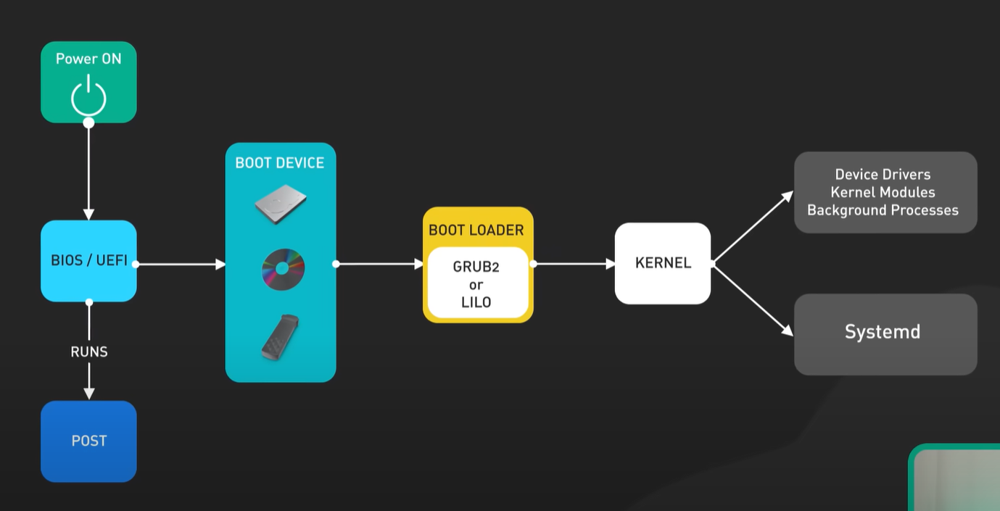

# Linux

# linux启动过程

## x86

1. power on：CPU从`0xFFFFFFF0`（复位向量）读取第一条指令，跳转到 BIOS 的 **复位代码**（位于 Flash 中）
2. BIOS/UEFI：存储在主板的非易失性存储，Flash。UEFI更新，更快，更安全（Secure Boot，验证操作系统和驱动程序）。
3. BIOS/UEFI RUN POST，确保硬件没问题。
4. 找到并运行boot loader软件，bootloader先检查驱动器（磁盘、U盘、CD）

​	BIOS的bootloader在MBR（Master Boot Record），UEFI的bootloader在单独的分区存储.efi文件

5. bootloader找到磁盘上的操作系统内核，把操作系统内核加载到内存，运行操作系统内核
6. 内核把自己解压到内存，在临时根文件系统执行/init脚本，检查硬件，加载设备驱动和内核模块
7. 切换到真实根文件系统，卸载临时文件系统
8. 执行初始化进程Systemd

***UEFI/BIOS***

BIOS使用MBR磁盘分区方式，限制磁盘大小2TB，只能分四个区；UEFI使用GUID  Partition Table（GPT），支持9.4ZB（ 9.4*10 ^21^），理论上可以无限分。

| **概念**       | **MBR**                            | **GPT**                                       | **作用说明**                                           |
| :------------- | :--------------------------------- | :-------------------------------------------- | :----------------------------------------------------- |
| **引导代码**   | 存储在 MBR 前 446 字节，第一个扇区 | 无（由 UEFI 直接加载 ESP 分区中的 .efi 文件） | MBR 的引导代码加载活动分区的 PBR；GPT 依赖 UEFI 固件。 |
| **分区标识**   | 通过 CHS/LBA 地址定位              | 使用 GUID 唯一标识分区                        | GPT 的分区名可读性更强（如 "Windows Data"）。          |
| **分区表备份** | 无                                 | 在磁盘末尾存储完整备份                        | GPT 分区表损坏后可恢复，MBR 损坏则数据丢失。           |
| **安全机制**   | 无校验，易被病毒篡改               | 支持 CRC32 校验和 Secure Boot                 | GPT 可防止恶意代码修改引导流程。                       |

## arm

1. 硬件复位->Boot ROM，执行厂商的硬件初始化代码，从指定存储设备加载第一阶段Bootloader（SD卡、Flash、网络）到内存
2. 第一阶段Bootloader（SPL）初始化 DDR、eMMC/USB 接口，验证 U-Boot 签名，加载U-Boot到内存，运行U-Boot
3. U-Boot初始化更多硬件（网卡、USB），加载Linux内核、设备树、根文件系统，提供交互式命令行，支持固件更新、网络启动
4. 用户空间初始化BusyBox提供轻量级init /etc/inittab /etc/init.d/rcS

# MCU启动过程（ARM Cortex-M）

1. system reset(hardware or software)

2. 所有寄存器设为初值
3. 启动文件：指令寄存器PC设为Interrupt vector table 的第二个地址，SP寄存器设为Interrupt vector table的第一个地址，栈指针。Interrupt vector table存储在flash的开头。
4. 判断从哪boot（flash）
5. 初始化C runtime，Data Section、BSS Section
6. call SystemInit

# Linux进程管理

## 进程定义

处于执行阶段的程序，包含代码段和其他资源（打开的文件、挂起的信号、内核内部数据、处理器状态、具有内存映射的内存地址空间及线程、数据段）

线程是进程中活动的对象，拥有独立的程序计数器、进程栈、进程寄存器，内核调度的对象是线程。Linux不对进程和线程做区分。

## 进程流程

1. fork()创建进程（通过clone()系统调用实现）
2. exec函数组用指定程序替换进程
3. exit()系统调用退出执行，变为僵死状态
4. 父进程通过wait4()系统调用等待进程执行完毕

## 进程描述符

结构体task_struct-进程描述符，描述进程的所有信息（打开的文件、进程的地址空间、挂起的信号、进程状态），存放在任务队列task list（双向循环链表）。进程的内核栈栈底存放thread_info指向task_struct。

## 进程状态

进程描述符的state描述进程状态。

1. TASK_RUNNING
2. TASK_INTERRUPTIBLE
3. TASK_UNINTERRUPTIBLE
4. __TASK_TRACED
5. __TASK_STOPPED

## 进程上下文

## 进程家族树

# Linux进程调度

## 多任务

Linux提供抢占式多任务，特殊情况有非抢占。

## Linux进程调度

调度器核心调用 `pick_next_task()`，按优先级顺序查看调度类（stop → dl → rt → fair → idle）是否有可运行任务， **高优先级调度类的任务永远优先**，只有高优先级队列为空时，才会检查低优先级队列。调度类内部自己管理任务队列，决定选哪个任务。

Linux 采用 **模块化调度类**，不同调度策略由不同的调度类实现，按优先级顺序排列：

1. **`stop_sched_class`**（最高优先级）
   - 用于 CPU 热插拔和迁移任务，不可被抢占。
2. **`dl_sched_class`**（Deadline 调度）
   - 实现 `SCHED_DEADLINE`，确保任务在截止时间内完成。
3. **`rt_sched_class`**（实时调度）
   - 实现 `SCHED_FIFO` 和 `SCHED_RR`，用于实时任务。
4. **`fair_sched_class`**（完全公平调度 CFS）
   - 默认调度类，实现 `SCHED_NORMAL`/`SCHED_BATCH`/`SCHED_IDLE`。
5. **`idle_sched_class`**（最低优先级）
   - 当 CPU 无任务可运行时，运行 `idle` 进程（`swapper`）。

调度器通过 **`pick_next_task()`** 依次检查各调度类，选择最高优先级的可运行任务。

## 进程优先级范围

1. nice
2. 实时优先级

实时进程优先级高于普通进程

## 时间片

## Linux调度算法

Linux 支持多种调度策略，适用于不同场景的进程：

| **调度策略**         | **描述**                                                 | **适用场景**                |
| :------------------- | :------------------------------------------------------- | :-------------------------- |
| **`SCHED_NORMAL`**   | 默认策略（CFS 调度器），基于时间片和优先级进行公平调度。 | 普通用户进程                |
| **`SCHED_FIFO`**     | 实时先进先出策略，高优先级进程独占 CPU 直到主动退出。    | 硬实时任务（如工业控制）    |
| **`SCHED_RR`**       | 实时轮转策略，高优先级进程按时间片轮转。                 | 软实时任务（如音视频处理）  |
| **`SCHED_DEADLINE`** | 基于截止时间的调度，确保任务在 deadline 前完成。         | 实时性要求极高的任务        |
| **`SCHED_BATCH`**    | 批处理模式，减少交互性，适合后台计算任务。               | 长时间运行的 CPU 密集型任务 |
| **`SCHED_IDLE`**     | 最低优先级，仅当系统空闲时运行。                         | 后台低优先级任务            |

O(1)调度：activate和expired

完全公平调度算法（CFS）：每当任务运行一个 **实际时间片（`delta_exec`）** 后，其 `vruntime` 更新为：
$$
\text{vruntime} += \frac{\text{delta\_exec} \times \text{NICE\_0\_LOAD}}{\text{weight}}
$$

$$
\text{weight} = \text{sched\_prio\_to\_weight}[\text{nice} + 20]
$$

$$
\text{sched\_slice} = \frac{\text{target\_latency} \times \text{weight}}{\sum \text{weights}}
$$

# 信号

*是一种软件中断*

# Linux进程通信

